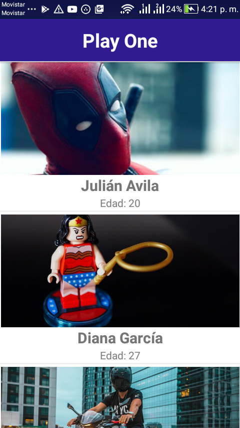
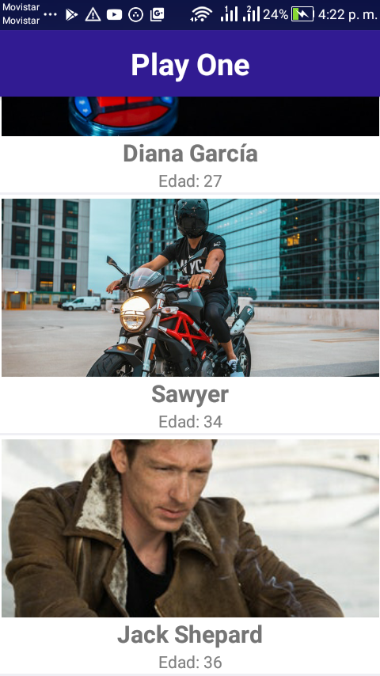
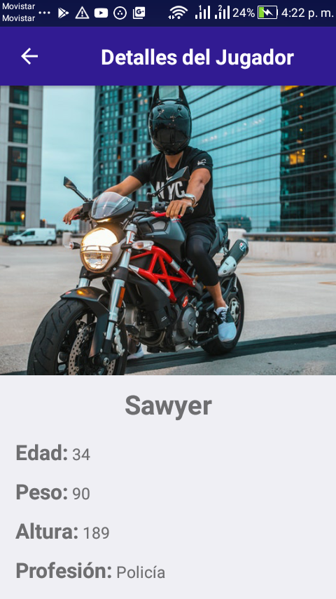

# PlayOne

La apliación móvil esta escrita con React Native y se compone de dos vistas, la vista principal se imprime un listado de jugadores de la cual es accedida desde una estructura JSON que se encuentra alojada en https://www.jasonbase.com/things/6zoj.json. La segunda vista se visualiza cuando el usuario toca el item de un jugador para que pueda ver las características completas del jugador seleccionado.


## Requisitos
- Nodejs
- React Native
- Emulador de Android o IOS o tener conectado un Movil para que sea detectado por el compilador


## Instalación y Ejecución

- Descargar o clonar el repositorio ```git clone https://github.com/avilajul/PlayOne.git```
- Ingresar a la carpeta raíz del repositorio cd PlayOne
- Instalar las dependencias con el comando ```npm install```
- Después de la instalación de depencias se corre la apliación con el comando ```react-native run-android```


## capturas de pantalla

- Vista principal
- 
- 

- Vista Secundaria
- 
